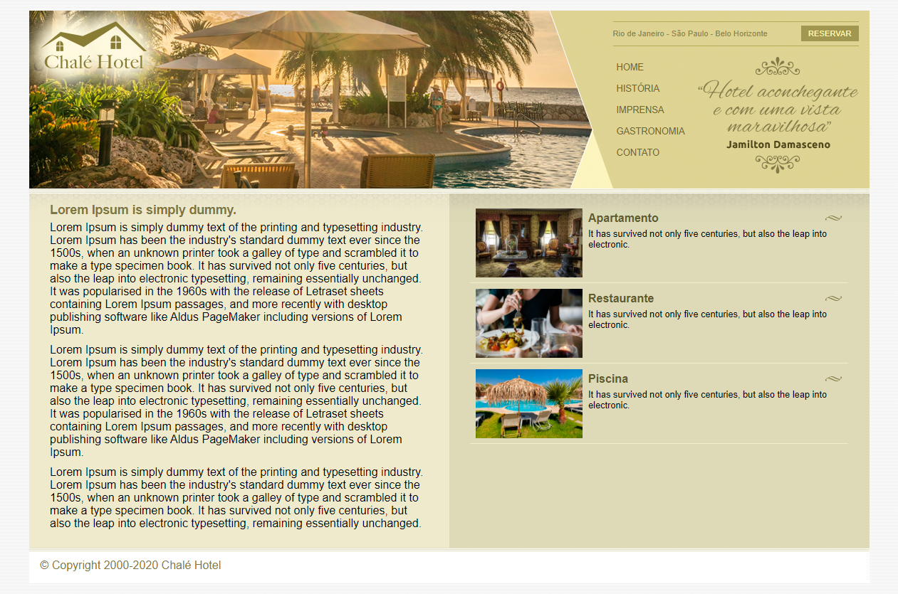

# Chalé Hotel
> Projeto acadêmico.

Projeto acadêmico, escrito em HTML & estilizado com CSS3, se trata de um site para um resort fictício. 

Projeto desenvolvido no curso de __Desenvolvimento web completo__, abordando os princípios da linguagem HTML & principais recursos do CSS3. 

## Meta

Paulo Marques - [@prmarquesz](https://twitter.com/prmarquesz) - paulormarques21@gmail.com

Udemy - [Curso de Desenvolvimento Web completo](https://www.udemy.com/course/web-completo/)